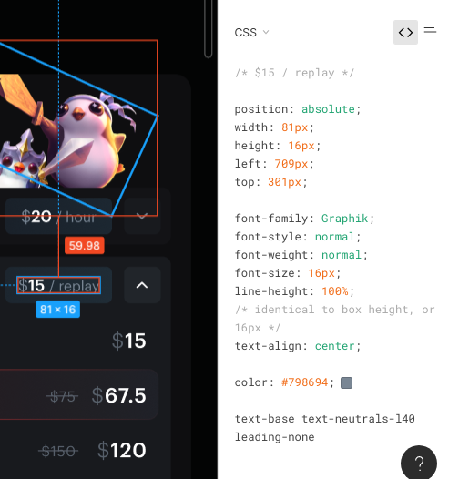

# Figma to Tailwind

Convert Figma CSS rules to Tailwind classes automatically right in the Figma inspector pane.

## How to use

Paste your built Tailwind CSS file in `tailwind.css`, then run `./create-bookmarklet.sh`, which will generate `bookmarklet.js` that you can copy paste into a new bookmarklet.

Open a Figma tab and click the bookmarklet.